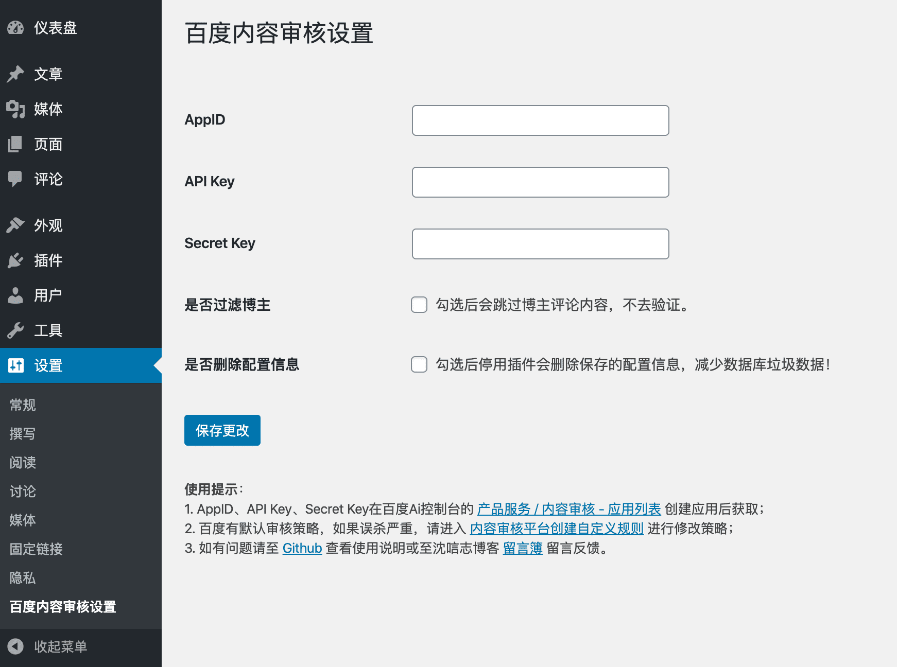

<h2 align="center">Baidu TextCensor</h2>

<p align="center">
🗑 在WordPress中加入百度文本内容审核，过滤评论中的敏感内容
    
</p>

## 百度文本内容审核

[百度文本内容审核](https://ai.baidu.com/tech/textcensoring)能一站式检测文本中夹杂的色情、推广、辱骂、违禁、涉政、灌水等垃圾内容，净化网络环境，为您的应用提供更可靠的内容安全保障，运用业界领先的深度学习技术，判断一段文本内容是否符合网络发文规范，实现自动化、智能化的文本审核，大幅节省内容审核的人力成本，为您的产品体验保驾护航

### 能力介绍

* 文本色情：对文本中的色情行为描述、色情资源链接、低俗交友、污秽文爱等内容进行识别
* 暴恐违禁：对暴力行为、恐怖描述、赌博、毒品、枪支弹药等违禁内容进行识别
* 政治敏感：对文本中的敏感事件、涉政人物、散布谣言、反动宣传等内容进行识别
* 恶意推广：对文本中带有售卖意向的软文广告，微信、QQ等个人联系方式等违规内容及变体进行识别
* 低俗辱骂：对文本中的侮辱谩骂、人身攻击、消极宣泄等内容进行识别
* 低质灌水：对网络社区常见的乱码、水帖、刷屏等无意义的灌水信息进行识别

## WordPress

### 安装

1. 下载源码

从 Github 或 [WordPress Plugins](https://wordpress.org/plugins/baidu-textcensor/) 下载源码，通过 WordPress 后台上传安装，或者直接将源码上传到 WordPress 插件目录 `wp-content/plugins`，然后在后台启用

2. 在 WordPress 后台搜索 `Baidu TextCensor`

### 设置

在百度Ai控制台的 [产品服务 / 内容审核 - 应用列表 创建应用](https://console.bce.baidu.com/ai/?fromai=1#/ai/antiporn/app/list) 后获取 AppID、API Key、Secret Key



## 其他插件推荐

* [wordpress-qcloud-cos](https://github.com/sy-records/wordpress-qcloud-cos) 使用腾讯云对象存储服务 COS 作为附件存储空间
* [wp-geetest](https://github.com/sy-records/wp-geetest) 基于极验 3.0，在 WordPress 的登录和评论时加入极验验证
* [PushWordPressToWeChat](https://github.com/sy-records/PushWordPressToWeChat) 基于 PushBear 服务提供 WordPress 内容更新微信订阅推送，需要微信认证订阅号/服务号

## 其他博客系统

### 安装

在其他博客系统中，如 ThinkPHP、Laravel 等，可以直接使用 composer 包，自行调用处理

项目地址：[https://github.com/sy-records/baidu-textcensor](https://github.com/sy-records/baidu-textcensor)

```bash
composer require sy-records/baidu-textcensor
```

### 使用

```php
$appId = "";
$apiKey = "";
$secretKey = "";

$client = new \Luffy\TextCensor\Core($appId, $apiKey, $secretKey);
$res = $client->textCensorUserDefined("沈唁志博客：https://qq52o.me"); //待审核文本字符串

//具体参数说明见：https://ai.baidu.com/ai-doc/ANTIPORN/Nk3h6xbb2
var_dump($res);
```

## License

Apache-2.0